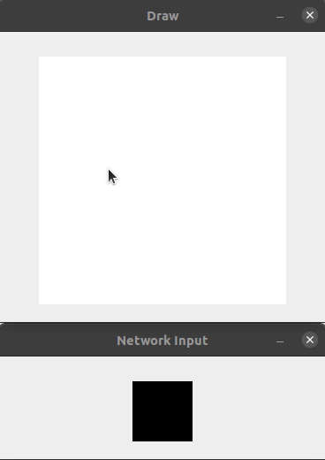

# Hand-Drawn-Sketch-Classification

This project focuses on classifying hand-drawn sketches in real-time 
on a computer system using convolutional neural network at its core. 
In this project I used the MNIST dataset to train the base model 
and then applied this model on the main problem by the means of 
transfer learning.

## Sample

&nbsp;&nbsp;&nbsp;
&nbsp;&nbsp;&nbsp;

## Install
 - Clone the repository
 -     pip3 install -r requirements.txt
## Usage
 - Execute [main.py](main.py)
   -     python main.py
 - Draw on the canvas
 - Press:
   -    `d` --> detect
   -    `c` --> clear 
   -    `esc` --> exit

## 📝 License

This project is [MIT](LICENSE) licensed.